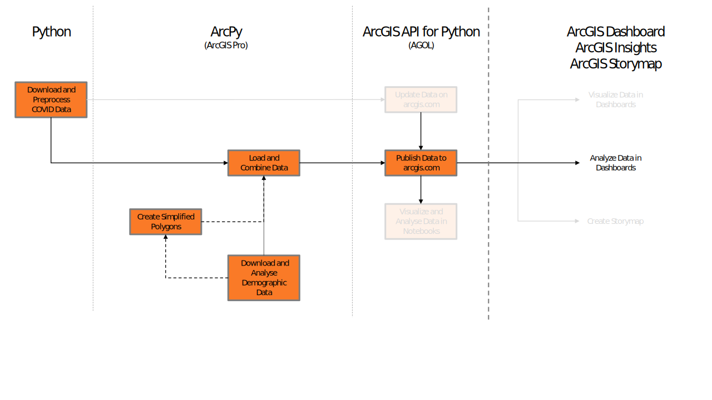
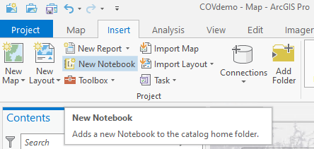
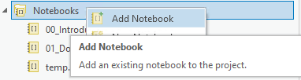

# Gathering and processing Data for ArcGIS Pro / Dashboard

## Introduction

The goal of this training series is to show common steps in data gathering, processing, publishing and visualisation utilizing ArcGIS Notebooks, ArcGIS Pro, ArcGIS Dashboards, and ArcGIS Insights. As an example, the open data on COVID-19 cases in Estonia will be used.

The training will be divided into several parts:

**Basic Python Workflows**

1\. [Get and Preprocess data from Estonian Open Data Platform](https://github.com/MBennGit/agcovdemo/blob/master/01_Download_and_Preprocess_Data.ipynb)

**Workflows with ArcPy and ArcGIS Pro**

2a\. [Download and Analyze Demographic Data](https://github.com/MBennGit/agcovdemo/blob/master/02a_Download_and_Analyze_Demographic_Data.ipynb)

2b\. [Create Simplified Polygons](https://github.com/MBennGit/agcovdemo/blob/master/02b_Create_Simplified_Polygons.ipynb)

2c\. [Load and combine timeseries data](https://github.com/MBennGit/agcovdemo/blob/master/02c_Load_and_combine_timeseries_data.ipynb)


**Workflows with the ArcGIS API for Python**

3a\. [Publish Data to arcgis.com](https://github.com/MBennGit/agcovdemo/blob/master/03a_publish_data_into_arcgis.com.ipynb)

3b\. Update Data on arcgis.com (planned)

3c\. Visualize and Analyze Data in Notebooks (planned)

**Demonstration on how to set up ArcGIS Online**

4a\. [Creating ArcGIS Dashboards](https://github.com/MBennGit/agcovdemo/blob/master/04a_visualize_data_in_arcgis.com.ipynb)

4b\. Creating ArcGIS Insight workbooks (planned)

4a\. Creating ArcGIS Storymaps (planned)





The reason behind publishing this document is not to encourage everyone to create their own data visualization on this critical topic. (See [this article](https://www.williamrchase.com/post/why-i-m-not-making-covid19-visualizations-and-why-you-probably-shouldn-t-either/) by William R. Chase.) Instead it should help to understand the steps to create dashboards and provide transparency for the workflows.

More so, the workflow and steps chosen are not always ideal. Instead, the reason behind chosing these ways is to highlight the functionality behind ```arcpy``` and ```arcgis``` libraries and give examples on how to use them. 

For the best experience, please clone/download the repository and import it into ArcGIS Pro 2.5.
In the ribbon bar navigate to "Insert" and click "New Notebook".



Create a temporary empty Notebook (can be deleted later).
In the Catalog tab, select "Notebook", right-click and select "Add Notebook".



Navigate to the downloaded folder and import the desired Notebooks.
